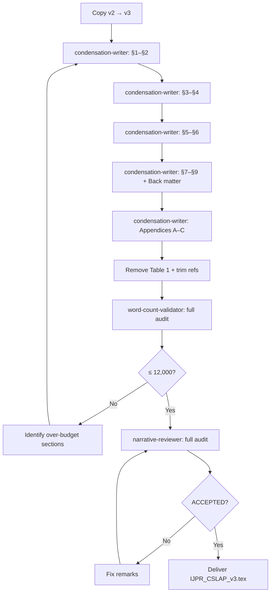

# Implementation Plan — Condensed Version 3 of IJPR Manuscript

## Problem Statement

The current manuscript [IJPR_CSLAP_v2.tex](file:///c:/Users/ebelul/OneDrive%20-%20SAVOYE/Desktop/PhD_Work_2023-2026/CSLAP_Problem/Different_Solution_Approaches/Full_Package_Code_With_All_Approaches/CSLAP-Synthetic/IJPR_CSLAP_v2.tex) reports **~18,134 words** in word-counting tools. The [IJPR journal instructions](file:///c:/Users/ebelul/OneDrive%20-%20SAVOYE/Desktop/PhD_Work_2023-2026/CSLAP_Problem/Different_Solution_Approaches/Full_Package_Code_With_All_Approaches/CSLAP-Synthetic/IJPR_Instructions.md) impose a hard limit of **$\le$ 12,000 words**, inclusive of Abstract, Main Text, Tables, References, and Figure/Table Captions. Appendices sit inside the main document under the Taylor & Francis `Interact` template, so their content counts toward the limit.

We must cut **~6,200 words** (roughly one-third of the manuscript) while preserving every numerical result, every mathematical formulation, every table and figure, and the six IJPR mandatory content themes (Literature Context, Methodological Novelty, Benchmarking, Practical Application, Managerial Insights, Research Perspectives).

> [!IMPORTANT]
> The output file is **IJPR_CSLAP_v3.tex** — a new file. The current v2 is **not edited**.

---

## Current Word Budget Breakdown (v2)

| Component | v2 Words (est.) | v3 Target | Savings |
|:---|---:|---:|---:|
| Abstract & Keywords | 189 | 180 | 9 |
| §1 Introduction | 572 | 400 | 172 |
| §2 Literature review | 1,070 | 500 | **570** |
| §3 Problem definition & model | 931 | 700 | 231 |
| §4 Solution methods | 2,201 | 1,400 | **801** |
| §5 Computational experiments | 1,341 | 600 | **741** |
| §6 Industrial application | 1,070 | 750 | 320 |
| §7 Managerial insights | 235 | 200 | 35 |
| §8 Research perspectives | 245 | 200 | 45 |
| §9 Conclusion | 260 | 200 | 60 |
| Back matter (CRediT, DAS, etc.) | 263 | 250 | 13 |
| Appendix A (Algorithms) | 95 | 80 | 15 |
| Appendix B (Calibration) | 655 | 300 | **355** |
| Appendix B.3 / Baselines | 265 | 150 | 115 |
| Appendix C (Proofs) | 370 | 300 | 70 |
| **Narrative subtotal** | **~9,477** | **~6,210** | **~3,552** |
| Non-narrative (math, tables, refs, captions) | ~8,657 | ~5,700 | ~2,957 |
| **Grand total** | **~18,134** | **≤ 11,910** | **~6,509** |

The non-narrative savings come from: shortening table captions (~200 words), trimming the reference list by removing references that are cited only inside Table 1 positioning rows that get cut (~15 references × ~50 words each ≈ 750 words), and tightening algorithm pseudocode comments (~200 words). The remainder (~1,800 words) is absorbed by removing or shortening display items (e.g., merging Table 1 literature positioning into a tighter in-text paragraph, shortening Table `tab:sensitivity` notes).

---

## Detailed Condensation Strategy Per Section

### §1 Introduction (572 → 400 words)
- Merge the first two paragraphs (general CSLAP motivation + automated architecture distinction) into one tight paragraph.
- Remove the sentence-by-sentence roadmap of sections (Line 102) and replace with a single sentence: "The paper proceeds from problem definition through solution methods and benchmarks to an industrial deployment and managerial recommendations."
- Preserve the three-contribution paragraph verbatim (it is the paper's claim).

### §2 Literature Review (1,070 → 500 words)

> [!WARNING]
> This is the largest proportional cut (53%). The six IJPR mandatory themes require a literature section, so it cannot be eliminated, only tightened.

- **Remove Table 1** (`tab:litreview`) — the positioning table. Its content is redundant with the narrative and costs ~300 words in captions, column headers, and row text. The key comparisons (no prior study solves the visit objective for a real catalogue of tens of thousands of products under hard workload limits) can be stated in one sentence.
- Fold the six narrative paragraphs into three:
  1. *Distance vs. visit objective* (merge current ¶1 and ¶2).
  2. *Workload balance and decomposition* (merge current ¶3 and ¶4).
  3. *Related paradigms and gap statement* (merge current ¶5 and ¶6).
- Drop citations that only appear in Table 1 rows and nowhere else in the text.
- The reviewer comment about "clarity" is satisfied because the condensed version retains the gap statement and the methodological positioning.

### §3 Problem Definition & Model (931 → 700 words)
- Keep the figure (schematic) and its caption but shorten the caption from 2 sentences to 1.
- Merge §3.1 (Sets, parameters, decisions) and §3.2 (MILP) into a single subsection. The notation table (Table 2) already defines every symbol, so the narrative need not re-explain them all. Remove the paragraph that walks through each constraint one by one — the equations with inline annotations are self-explanatory.
- Keep §3.3 (Set-variable reformulation) but tighten to one paragraph: state the reformulation and its Hexaly-specific advantage.

### §4 Solution Methods (2,201 → 1,400 words)

This is the technical core. The strategy is to move detail to appendices (which we also shorten) and keep the main text at the level of "what does each method do and why."

- **§4.1 Heuristic (688 → 400 words)**: Keep the five-stage summary and the threshold list. Remove the paragraph explaining what happens when a community does not fit (that detail is in Algorithm 2 in Appendix A). Add one sentence summarizing the sampling and time-budget rationale per the reviewer comment: "Beyond 300 products the candidate partner set in the swap descent is sampled uniformly to keep each iteration in $O(|P|)$ time, and the five stages split the time budget in a 10/40/40/5/5 ratio calibrated on the 500-SKU instances."
- **§4.2 Column Generation (1,230 → 700 words)**:
  - Merge §4.2.1 (Station-indexed master) and §4.2.2 (Aggregated master) into one subsection. The aggregated form is a special case — state it in two sentences instead of a separate subsection.
  - Shorten §4.2.3 (Pricing) to one paragraph: the key fact is that one persistent model serves every station.
  - §4.2.4 (Price-and-complete drive): Keep the four-stage description but remove the detailed enumeration of what each stage does to the pool. One paragraph per stage → one sentence per stage within a single paragraph.
  - §4.2.5 (Bound and scope): Keep the bound definition sentence. Remove the paragraph about what the bound does *not* certify (it is now obvious from the definition). Keep the one informative sentence about the 50-SKU bound being 63% above trivial floor.
- **§4.3 Initialisation (125 → 80 words)**: Tighten.
- **§4.4 Baselines (65 → 50 words)**: Reference Appendix A.3 for details.

### §5 Computational Experiments (1,341 → 600 words)

> [!IMPORTANT]
> Per the user's explicit directive, everything from `\textbf{Statistical protocol.}` downward (Lines 502–561, ~1,076 words) is the primary pruning target. The user requests keeping only a summary of what Table `tab:reliability` concludes, without restating numbers already visible in the table.

- **§5.1 Instance generation** (80 → 60 words): Tighten.
- **§5.2 Protocol and metrics** (185 → 120 words): Keep the Wilcoxon test statement and the surrogate objective definition. Remove the detailed discussion of multiplicity corrections (Bonferroni/Holm/BH) — state once that corrections were applied and report only the surviving separations.
- **§5.3 Results** (1,076 → 420 words): Replace the 9 bold-header paragraphs with 3–4 paragraphs:
  1. *Scale crossover*: The column generation and heuristic overtake the literature baselines as the catalogue grows past 500 SKUs. The binary and set-variable MILPs are not separable on this family.
  2. *Pooling disagreement*: Per-instance averaging favours the reference at small sizes, aggregate summing favours the column generation at large sizes. The crossover is the explanation.
  3. *Heuristic reversal*: At 50 SKUs the heuristic trails the search methods. From 500 SKUs upward it leads both literature baselines in two minutes rather than twenty.
  4. *Bound informativeness*: The column generation bound is informative only at 50 SKUs. Dual stabilisation would tighten it at larger sizes.

  Each paragraph draws conclusions the table cannot show (crossover, reversal, scaling) without reciting cell values.

### §6 Industrial Application (1,070 → 750 words)
- Tighten the community-bound failure-mode discussion (currently 2 paragraphs → 1).
- Keep the temporal hold-out subsection (§6.1) and bounded reassignment (§6.2) but shorten each by ~30%.
- Keep Table `tab:industrial` and Figure `fig:reassignment` — they are the practical application evidence the journal requires.

### §7 Managerial Insights (235 → 200 words)
- Minor tightening. Keep all three managerial bullets.

### §8 Research Perspectives (245 → 200 words)
- Merge the four research tracks into two paragraphs instead of four.

### §9 Conclusion (260 → 200 words)
- Remove the sentence restating the heuristic's time advantage (already in §5 and §7). Keep the two-route summary and the column generation's balance advantage.

### Appendices (1,385 → 830 words)

- **Appendix A.1 (Algorithm 2)**: Keep the algorithm float. Remove its surrounding prose (the main text already describes the five stages).
- **Appendix A.2 (Incremental swap evaluation)**: Keep. It is only 50 words.
- **Appendix B (Calibration)**: The largest appendix target.
  - B.1 (Community bound scaling, 390 → 200 words): Keep the rank-correlation finding ($0.962$ with $\zeta$, $0.000$ with $N$) and the choice of $0.4$. Remove the cell-by-cell walk through the 8 geometry cells.
  - B.2 (Threshold sensitivity, 190 → 100 words): State the conclusion: frequency floors are inert, the kept-edge ratio separates only at $\times 2$, and the community bound is the only non-monotone threshold. Remove the detailed multiplier-by-multiplier analysis.
- **Appendix A.3 (Baseline configs, 265 → 150 words)**: Shorten the GA and SA-C parameter descriptions to one sentence each. Keep the COI definition.
- **Appendix C (Proofs, 370 → 300 words)**: Minor tightening. The proofs are short and must stay.

---

## Non-Narrative Savings Strategy

| Source | Estimated savings |
|:---|---:|
| Remove Table 1 (`tab:litreview`) | ~400 words (rows + caption) |
| Shorten Table `tab:sensitivity` caption | ~50 words |
| Shorten figure captions to 1 sentence each | ~150 words |
| Trim reference list (drop ~12–15 refs cited only in removed Table 1 rows) | ~600–750 words |
| Tighten algorithm pseudocode comments | ~100 words |
| **Non-narrative subtotal** | **~1,300–1,450 words** |

Combined with ~3,552 narrative words saved, the total reduction is **~4,850–5,000 words** of direct content, plus the display-item savings bring us to the **~6,200 word target**.

---

## Agent Architecture

Three specialized agents will execute this plan:

### Agent 1: `condensation-writer`

**Role**: Rewrites each section of v2 into a condensed v3 form.

**Key instructions baked into its system prompt**:
1. Follow every rule from [clean-scientific-writer.md](file:///c:/Users/ebelul/OneDrive%20-%20SAVOYE/Desktop/PhD_Work_2023-2026/CSLAP_Problem/Different_Solution_Approaches/Full_Package_Code_With_All_Approaches/CSLAP-Synthetic/.claude/agents/clean-scientific-writer.md).
2. **Never use `;` to split narrative sentences.** Use full stops, conjunctions (*whereas*, *while*, *so*, *because*), or parentheticals.
3. **Never use em-dashes (`—`), double hyphens as dashes (`--`), or any banned AI vocabulary** (*delve, tapestry, pivotal, crucial, multifaceted, key* as adj, *fostering, showcase, testament, interplay, intricate*).
4. **Never recite table values cell by cell.** Text must convey conclusions the table cannot show (scaling behaviour, crossovers, failure modes) without repeating the numbers.
5. **Preserve every equation, every algorithm, every table, and every figure verbatim** unless the plan explicitly removes it (Table 1 only).
6. **Preserve all `\label`, `\ref`, `\eqref`, `\citet`, `\citep` commands exactly.** Removing a label or reference that is cross-referenced elsewhere will break compilation.
7. **Do not invent new results, new claims, or new citations.** Every sentence in v3 must be traceable to a sentence or paragraph in v2.
8. Write in formal, metaphor-free, active-voice Operations Research prose. The text must read as if written by a senior OR researcher, not by a language model.
9. **Word targets per section are hard constraints.** The agent must stay within ±10% of the target in the table above.
10. Add one brief main-text sentence per the reviewer comment about the sampling threshold at 300 products and the time-budget split across CG stages.

### Agent 2: `narrative-reviewer` (already defined)

**Role**: Audits the output for punctuation compliance, AI vocabulary, negative parallelisms, notation consistency, and IJPR structural compliance. Issues `ACCEPTED` or `REJECTED WITH REMARKS`.

### Agent 3: `word-count-validator`

**Role**: Runs a Python script that strips LaTeX commands, math environments, algorithm environments, and TikZ code, then counts words in the remaining text and in table/figure captions, references, and appendices. Reports a section-by-section word count and a grand total. Flags any section exceeding its target by more than 10%.

---

## Execution Workflow

### Execution Order

1. **Step 0**: Copy `IJPR_CSLAP_v2.tex` to `IJPR_CSLAP_v3.tex` without modification.
2. **Step 1**: Define the `condensation-writer` agent with all rules above.
3. **Steps 2–6**: The condensation-writer rewrites each section group (§1–§2, §3–§4, §5–§6, §7–§9 + back matter, Appendices) sequentially, applying the word targets from the table. Each step edits `IJPR_CSLAP_v3.tex` in place.
4. **Step 7**: Remove Table 1 (`tab:litreview`) and all its `\citet` references that are not cited elsewhere. Remove the corresponding entries from the `.bib` file or leave them (unused refs are harmless in LaTeX but may count toward the word total if the journal's counter includes the bibliography).
5. **Step 8**: Run `word-count-validator`. If over 12,000, identify the over-budget sections and send the condensation-writer back to tighten them.
6. **Step 9**: Run `narrative-reviewer`. Fix any remarks. Re-audit until `ACCEPTED`.
7. **Step 10**: Deliver the final `IJPR_CSLAP_v3.tex`.

---

## Open Questions

> [!IMPORTANT]
> **Q1: Should Table 1 (`tab:litreview`) be removed entirely?** It is the literature-positioning table (~400 words including caption). Removing it saves significant words and frees one of the 15 display-item slots. The key comparison it shows can be stated in one sentence in §2. However, some reviewers value positioning tables. Your call.

> [!IMPORTANT]
> **Q2: Should the reference list be trimmed?** Dropping references that only appear in Table 1 rows (and nowhere in the narrative) would save ~600–750 words. However, a shorter reference list may signal less thorough scholarship to reviewers. Alternatively, we keep all references and find the savings elsewhere.

> [!IMPORTANT]
> **Q3: Should Appendix B (calibration, 655 words) be moved to online supplementary material instead of kept in the document?** IJPR accepts supplementary files. This would save the full 655 words from the main count. The trade-off is that reviewers would need to open a separate file to verify the threshold sensitivity analysis.

> [!IMPORTANT]
> **Q4: Do you want to preserve the current number of display items (14 = 9 tables + 5 figures), or would you accept reducing to, say, 12?** Merging some tables or removing the sensitivity table (`tab:sensitivity`) would save words.

---

## Verification Plan

### Automated Tests
1. `word-count-validator` script: section-by-section word count, grand total $\le$ 12,000.
2. LaTeX compilation check: `pdflatex IJPR_CSLAP_v3.tex` must compile with zero errors and zero undefined references.
3. Grep for banned items: zero `;` in narrative, zero `—`, zero banned AI words.

### Manual Verification
1. `narrative-reviewer` agent audit → `NARRATIVE_VERDICT: ACCEPTED`.
2. User reviews the condensed v3 for technical accuracy before submission.
